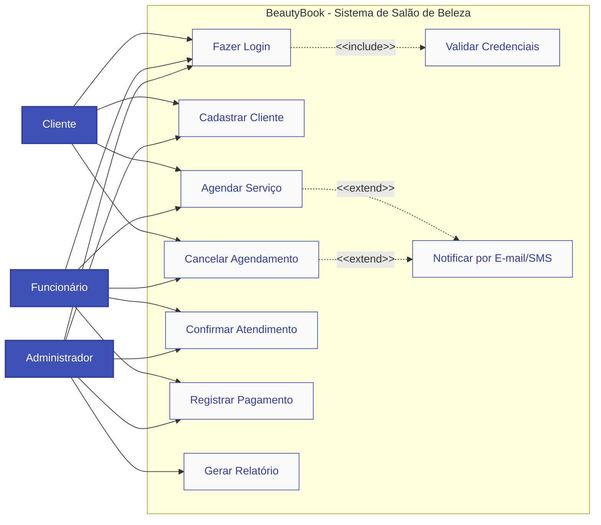
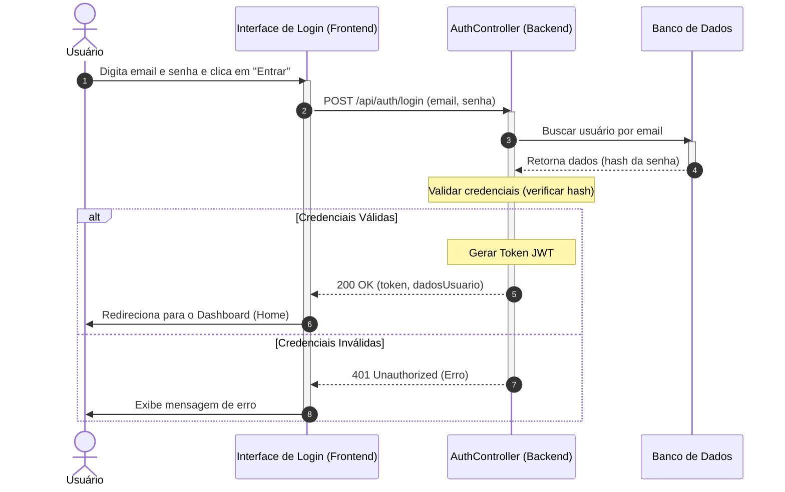
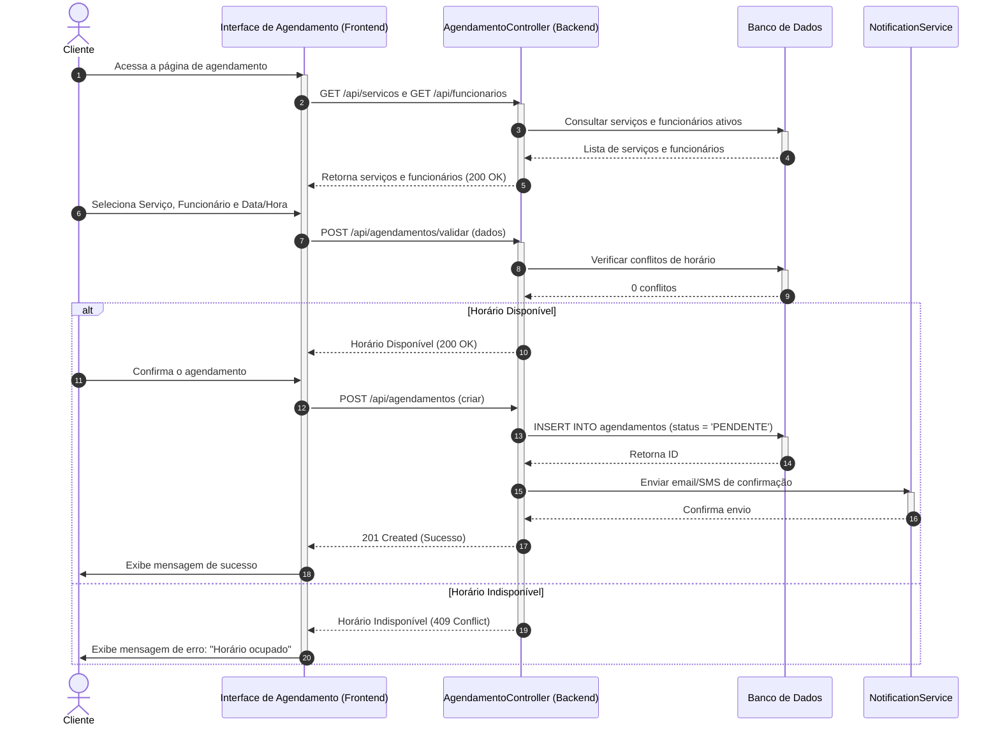
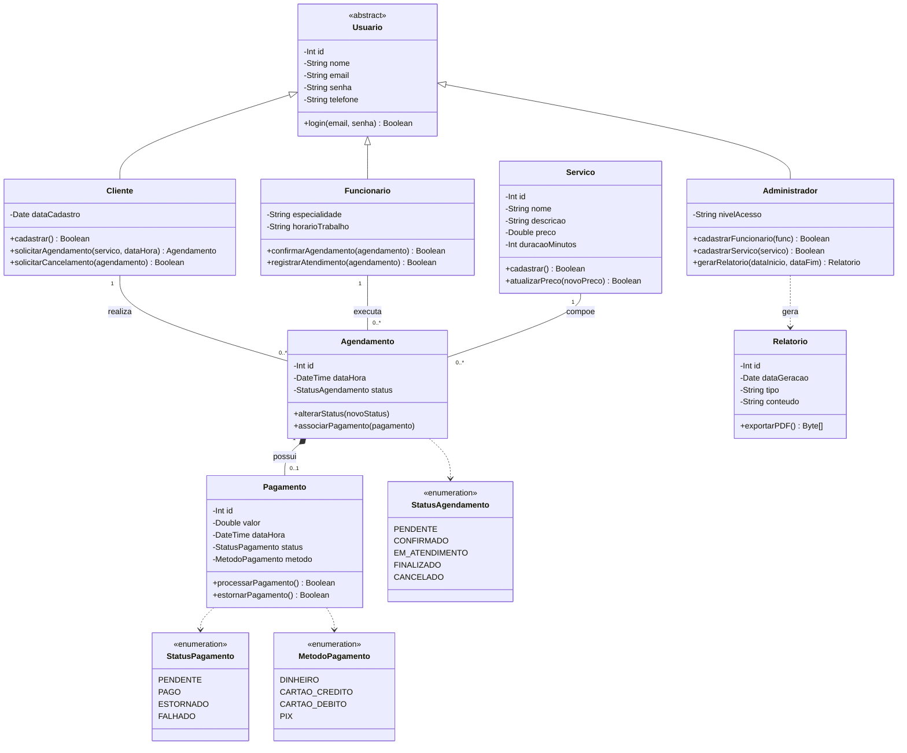
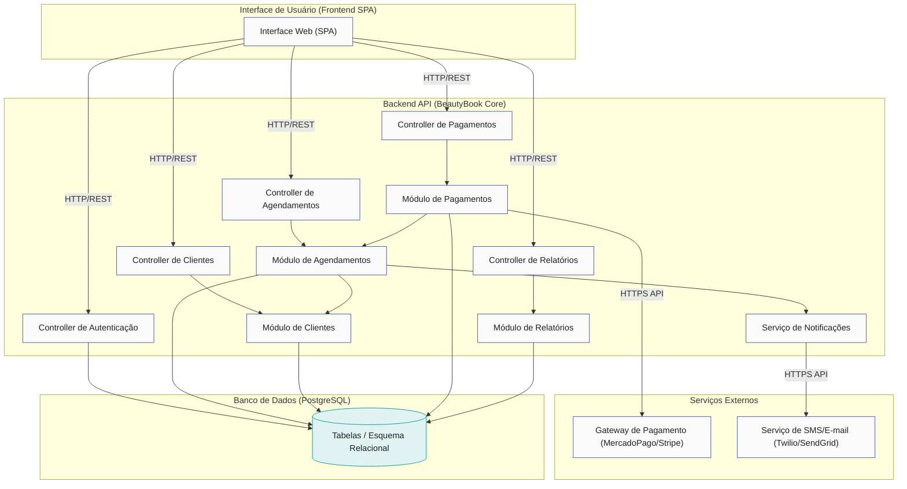

# BeautyBook

## 1. Introdução

O BeautyBook é um sistema pensado para ajudar um salão de beleza a organizar melhor os agendamentos, os clientes e os serviços oferecidos. A ideia é deixar o atendimento mais prático, evitando confusão com horários, encaixes e cancelamentos.

Nesse sistema, o cliente consegue marcar seu horário de forma mais fácil, enquanto o salão consegue visualizar os atendimentos do dia, controlar os serviços e acompanhar os pagamentos.

O projeto foi montado apenas na parte de análise, diagramação e arquitetura, sem desenvolvimento de código. Para isso, foram usados os conceitos vistos na disciplina e a modelagem foi feita com PlantUML.

---

# 2. Modelos de Usuário e Requisitos

## 2.1 Descrição de Atores

### Cliente
Pessoa que acessa o sistema para:
- Fazer login
- Agendar serviços
- Cancelar horários
- Acompanhar seus atendimentos

### Funcionário
Responsável por:
- Atender os clientes
- Confirmar agendamentos
- Atualizar informações do sistema

### Administrador
Cuida da parte geral do sistema, como:
- Cadastro de usuários
- Controle de serviços
- Relatórios
- Organização do salão

---

## 2.2 Casos de Uso

Os principais casos de uso do sistema são:

- Fazer login
- Cadastrar cliente
- Agendar serviço
- Cancelar agendamento
- Confirmar atendimento
- Registrar pagamento
- Gerar relatório

---

## 2.3 Sequência do Sistema

Foram criados diagramas de sequência para mostrar como o sistema funciona em situações do dia a dia, como login, agendamento e cancelamento. Esses diagramas ajudam a entender a ordem das interações entre o usuário e o sistema.


## Diagrama de Casos de Uso

📄 [Código-Fonte PlantUML](./diagrams/use_case.puml)



## Diagrama de Sequência — Fazer login

📄 [Código-Fonte PlantUML](./diagrams/seq_login.puml)



## Diagrama de Sequência — Agendar serviço

📄 [Código-Fonte PlantUML](./diagrams/seq_agendar.puml)



## Diagrama de Sequência — Cancelar agendamento

📄 [Código-Fonte PlantUML](./diagrams/seq_cancelar.puml)

```mermaid
sequenceDiagram
    autonumber
    actor Actor as Cliente / Funcionário
    participant Front as Interface de Agendamentos (Frontend)
    participant Backend as AgendamentoController (Backend)
    participant DB as Banco de Dados
    participant Notif as NotificationService
    
    Actor->>Front: Clica em "Cancelar Agendamento"
    activate Front
    Front->>Actor: Solicita confirmação de cancelamento
    Actor->>Front: Confirma cancelamento
    Front->>Backend: POST /api/agendamentos/{id}/cancelar
    activate Backend
    
    Backend->>DB: Buscar detalhes do agendamento por ID
    activate DB
    DB-->>Backend: Retorna dados (dataHora, status, ids)
    deactivate DB
    
    Note over Backend: Validar regra de antecedência (> 2 horas)
    
    alt Antecedência Válida (>= 2 horas)
        Backend->>DB: UPDATE agendamentos SET status = 'CANCELADO'
        activate DB
        DB-->>Backend: Confirmação de atualização
        deactivate DB
        Backend->>Notif: Enviar notificação de cancelamento
        activate Notif
        Notif-->>Backend: Confirmação de envio
        deactivate Notif
        Backend-->>Front: 200 OK (Cancelamento confirmado)
        Front->>Actor: Exibe sucesso e atualiza a lista
    else Antecedência Inválida (< 2 horas)
        Backend-->>Front: 400 Bad Request (Prazo não cumprido)
        deactivate Backend
        Front->>Actor: Exibe erro: "Cancelamento indisponível"
        deactivate Front
    end
```

## Diagrama de Classes

📄 [Código-Fonte PlantUML](./diagrams/classes.puml)



## Diagrama de Componentes

📄 [Código-Fonte PlantUML](./diagrams/componentes.puml)



## Diagrama de Implantação

📄 [Código-Fonte PlantUML](./diagrams/implantacao.puml)

```mermaid
graph TD
    subgraph UserDevice["Dispositivo do Usuário (PC / Mobile)"]
        subgraph Browser["Navegador Web"]
            SPA["SPA BeautyBook (HTML5/React)"]
        end
    end
    
    subgraph HostingFront["Hospedagem Frontend (Vercel / Netlify)"]
        Static["Arquivos Estáticos SPA"]
    end
    
    subgraph CloudApp["Servidor de Aplicação (Render / AWS EC2)"]
        subgraph Runtime["Runtime (Node.js / JVM)"]
            API["BeautyBook API (.js / .jar)"]
        end
    end
    
    subgraph CloudDB["Banco de Dados Gerenciado"]
        DBMS[("PostgreSQL Database")]
    end
    
    UserDevice -->|1: GET / (HTTPS)| HostingFront
    SPA -->|2: REST Request (HTTPS - Porta 443)| API
    API -->|3: JDBC/SQL (Porta 5432)| DBMS
    
    classDef node fill:#FAFAFA,stroke:#3F51B5,stroke-width:2px;
    classDef dbNode fill:#E0F2F1,stroke:#009688,stroke-width:2px;
    classDef art fill:#E8EAF6,stroke:#303F9F,stroke-width:1px;
    
    UserDevice:::node; HostingFront:::node; CloudApp:::node; CloudDB:::dbNode;
    SPA:::art; API:::art; DBMS:::dbNode
```

## Diagrama de Estados — Agendamento

📄 [Código-Fonte PlantUML](./diagrams/estados.puml)

```mermaid
stateDiagram-v2
    [*] --> Pendente : solicitarAgendamento()
    
    Pendente --> Confirmado : confirmarAgendamento()
    Pendente --> Cancelado : solicitarCancelamento()
    
    Confirmado --> EmAtendimento : registrarAtendimento()
    Confirmado --> Cancelado : solicitarCancelamento()\n[antecedência >= 2h]
    
    EmAtendimento --> Finalizado : registrarConclusao()
    
    Finalizado --> [*]
    Cancelado --> [*]
    
    note right of Pendente : entry: gerar registro pendente\nexit: notificar funcionário
    note right of Confirmado : entry: bloquear horário\nexit: enviar lembrete 2h antes
    note right of EmAtendimento : entry: registrar início do serviço\nexit: registrar fim do serviço
    note right of Finalizado : entry: gerar cobrança de pagamento
    note right of Cancelado : entry: liberar horário e notificar partes
```

## Diagrama de Comunicação

📄 [Código-Fonte PlantUML](./diagrams/comunicacao.puml)

```mermaid
graph TD
    Cliente["c : Cliente"]
    View["view : InterfaceAgendamento"]
    Ctrl["ctrl : AgendamentoController"]
    Servico["s : Servico"]
    Agendamento["a : Agendamento"]
    Notif["notif : NotificationService"]
    
    Cliente -->|1: solicitarAgendamento()| View
    View -->|2: criarAgendamento()| Ctrl
    Ctrl -->|3: obterDetalhesServico()| Servico
    Ctrl -->|4: <<create>> novo()| Agendamento
    Ctrl -->|5: enviarConfirmacao()| Notif
    Ctrl -->|6: exibirSucesso()| View
    View -->|7: mostrarConfirmacao()| Cliente
    
    classDef obj fill:#FAFAFA,stroke:#3F51B5,stroke-width:1px,color:#212121;
    Cliente:::obj; View:::obj; Ctrl:::obj; Servico:::obj; Agendamento:::obj; Notif:::obj;
```

---

# 3. Modelos de Projeto

## 3.1 Arquitetura

A arquitetura do BeautyBook foi pensada de forma simples e organizada, usando uma estrutura em camadas.

A parte visual fica no frontend, a lógica do sistema fica no backend, e os dados são guardados no banco de dados. Essa separação ajuda bastante na organização do projeto e facilita alterações futuras.

---

## 3.2 Componentes e Implantação

O sistema foi dividido em componentes principais:

- Interface web
- API
- Módulos de agendamento
- Clientes
- Pagamentos

Na implantação, o cliente acessa o sistema pelo navegador, que se comunica com o servidor de aplicação. Esse servidor, por sua vez, conversa com o banco de dados.

---

## 3.3 Diagrama de Classes

O diagrama de classes mostra os principais objetos do sistema e como eles se relacionam.

As classes principais são:
- Cliente
- Funcionário
- Serviço
- Agendamento
- Pagamento

---

## 3.4 Diagramas de Sequência

Os diagramas de sequência mostram o passo a passo de algumas ações importantes do sistema, como:
- Login
- Agendamento
- Cancelamento

---

## 3.5 Diagramas de Comunicação

Esse diagrama foi usado para mostrar como os objetos trocam mensagens durante a execução das funcionalidades.

---

## 3.6 Diagramas de Estados

O diagrama de estados mostra como um agendamento pode mudar ao longo do tempo, começando como criado, depois confirmado, em atendimento e finalizado, ou então cancelado.

---

# 4. Modelos de Dados

O banco de dados do BeautyBook foi pensado com tabelas para:
- Clientes
- Funcionários
- Serviços
- Agendamentos
- Pagamentos

A ideia é guardar tudo de forma organizada para que o sistema consiga consultar, atualizar e relacionar as informações sem dificuldade.
