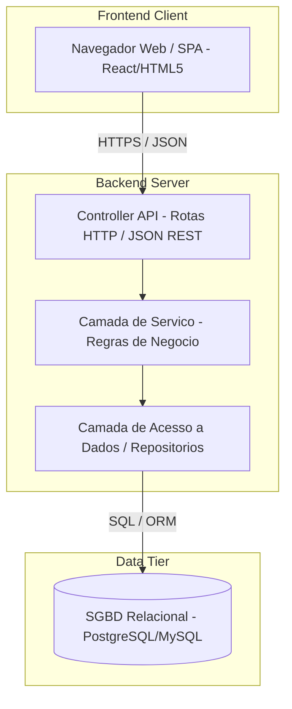
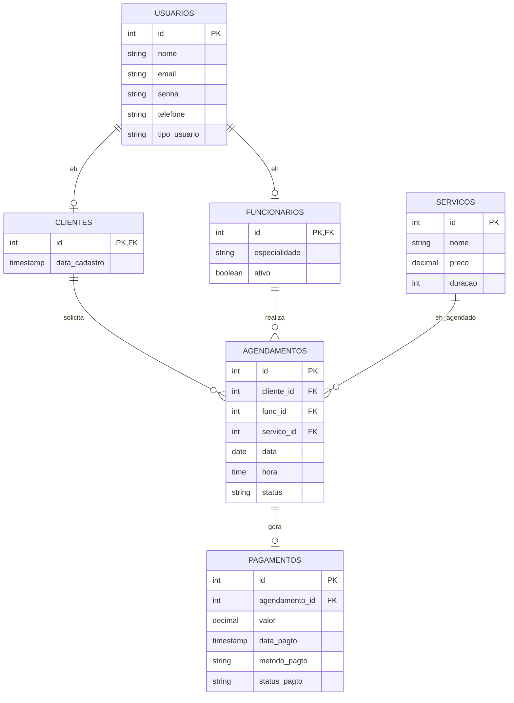

# BeautyBook

## Tabela de Conteúdo
1. [Introdução](#1-introdução)
2. [Modelos de Usuário e Requisitos](#2-modelos-de-usuário-e-requisitos)
   - 2.1 [Descrição de Atores](#21-descrição-de-atores)
   - 2.2 [Modelo de Casos de Uso e Histórias de Usuários](#22-modelo-de-casos-de-uso-e-histórias-de-usuários)
   - 2.3 [Diagrama de Sequência do Sistema e Contrato de Operações](#23-diagrama-de-sequência-do-sistema-e-contrato-de-operações)
3. [Modelos de Projeto](#3-modelos-de-projeto)
   - 3.1 [Arquitetura](#31-arquitetura)
   - 3.2 [Diagrama de Componentes e Implantação](#32-diagrama-de-componentes-e-implantação)
   - 3.3 [Diagrama de Classes](#33-diagrama-de-classes)
   - 3.4 [Diagramas de Sequência](#34-diagramas-de-sequência)
   - 3.5 [Diagramas de Comunicação](#35-diagramas-de-comunicação)
   - 3.6 [Diagramas de Estados](#36-diagramas-de-estados)
4. [Modelos de Dados](#4-modelos-de-dados)

## Histórico de Revisões
| Nome | Data | Razões para Mudança | Versão |
| :--- | :--- | :--- | :--- |
| Matheus Soares | 2026-06-02 | Estrutura inicial do documento de modelagem do sistema. | v1.0 |
| Matheus Soares | 2026-06-02 | Reestruturação acadêmica, detalhamento de requisitos, contratos de operação e modelo de dados. | v1.1 |

---

## 1. Introdução

Este documento agrega a elaboração e revisão de modelos de domínio e modelos de projeto para o sistema **BeautyBook**. A referência principal para a descrição geral do problema, domínio e requisitos do sistema é o documento de especificação que descreve a visão de domínio do sistema.

O **BeautyBook** é um sistema de software concebido para auxiliar salões de beleza no gerenciamento de suas operações diárias. O sistema visa otimizar o agendamento de horários, o controle da carteira de clientes, a escala de atendimento dos funcionários e o registro de fluxos financeiros decorrentes dos serviços prestados. A modelagem e documentação apresentadas a seguir foram desenvolvidas utilizando a especificação UML (Unified Modeling Language) expressa via PlantUML, com foco exclusivo em engenharia de requisitos, design de projeto e arquitetura de software.

---

## 2. Modelos de Usuário e Requisitos

### 2.1 Descrição de Atores

Nesta subseção é apresentada a descrição de cada um dos atores que interagem com o sistema:

*   **Cliente**: Pessoa física que utiliza o sistema principalmente em modo de autoatendimento. Suas necessidades incluem a busca por serviços, a verificação de disponibilidade de horários com profissionais do salão, a realização e cancelamento de agendamentos, e o acompanhamento de seu histórico pessoal.
*   **Funcionário**: Profissional ou colaborador do salão responsável pela execução dos serviços de beleza (cabeleireiros, esteticistas, manicures, etc.). Interage com o sistema para consultar sua agenda individual de atendimentos e atualizar o status de execução das ordens de serviço.
*   **Administrador**: Usuário com permissões totais sobre as configurações de negócio e dados do salão. É responsável pelo gerenciamento de cadastros de funcionários e serviços (incluindo tabelas de preços e tempo estimado), controle de fluxos de pagamento, e análise de relatórios gerenciais e de faturamento.

---

### 2.2 Modelo de Casos de Uso e Histórias de Usuários

Nesta subseção é apresentado o diagrama de casos de uso do sistema. Cada caso de uso é identificado por um ID de referência.

#### Lista de Casos de Uso (UML Use Cases)
*   **UC-01**: Efetuar Autenticação (Login)
*   **UC-02**: Cadastrar Cliente
*   **UC-03**: Agendar Serviço
*   **UC-04**: Cancelar Agendamento
*   **UC-05**: Confirmar Atendimento
*   **UC-06**: Registrar Pagamento
*   **UC-07**: Gerar Relatório Gerencial

#### Histórias de Usuário (User Stories)
*   **US-01 (Autenticação)**: *Como* usuário do sistema (Cliente, Funcionário ou Administrador), *eu quero* acessar o sistema informando meu e-mail e senha cadastrados, *para que* possa utilizar os recursos específicos associados ao meu perfil com segurança.
*   **US-02 (Cadastro)**: *Como* cliente sem cadastro prévio, *eu quero* preencher um formulário com meus dados básicos (nome, e-mail, celular), *para que* eu possa ser identificado no sistema e agendar serviços de forma autônoma.
*   **US-03 (Agendamento)**: *Como* cliente autenticado, *eu quero* selecionar um serviço, um profissional de minha preferência, e um horário livre, *para que* eu possa efetuar a reserva desse atendimento na data desejada.
*   **US-04 (Cancelamento)**: *Como* cliente ou administrador, *eu quero* cancelar um agendamento futuro no sistema, *para que* o horário correspondente seja liberado na agenda do profissional associado.
*   **US-05 (Confirmar Atendimento)**: *Como* funcionário, *eu quero* marcar o agendamento em andamento como finalizado, *para que* o sistema mude o status para indicar que o serviço foi concluído e está pendente de recebimento financeiro.
*   **US-06 (Registrar Pagamento)**: *Como* funcionário ou administrador, *eu quero* lançar o valor correspondente e a forma de pagamento do atendimento concluído, *para que* o status financeiro do agendamento seja quitado.
*   **US-07 (Relatórios)**: *Como* administrador, *eu quero* visualizar relatórios periódicos de faturamento e quantidade de agendamentos executados, *para que* eu possa gerenciar a produtividade e a saúde financeira do salão.

#### Diagrama de Casos de Uso do Sistema

---

### 2.3 Diagrama de Sequência do Sistema e Contrato de Operações

Nesta subseção são apresentados os diagramas de sequência do sistema (DSS) de 3 casos de uso descritos anteriormente, seguidos por seus respectivos contratos de operações do sistema. Os diagramas de sequência representam o comportamento do sistema sob a perspectiva de uma caixa-preta, ilustrando os eventos de entrada que os atores direcionam ao sistema.

#### Diagrama de Sequência do Sistema — Fazer login

#### Diagrama de Sequência do Sistema — Agendar serviço

#### Diagrama de Sequência do Sistema — Cancelar agendamento

#### Contratos de Operação

##### Contrato 1
| Campo | Descrição |
| :--- | :--- |
| **Contrato** | CO-01 (Autenticação) |
| **Operação** | `fazerLogin(usuario, senha)` |
| **Referências cruzadas** | UC-01, US-01 |
| **Pré-condições** | O e-mail e senha do usuário devem estar cadastrados no sistema. |
| **Pós-condições** | - Foi gerada uma sessão ativa para o usuário no servidor de aplicação. - Foi retornado um token de autenticação contendo o perfil do ator para restrição de rotas. |

##### Contrato 2
| Campo | Descrição |
| :--- | :--- |
| **Contrato** | CO-02 (Agendamento) |
| **Operação** | `criarAgendamento(clienteId, servicoId, funcionarioId, data, hora)` |
| **Referências cruzadas** | UC-03, US-03 |
| **Pré-condições** | - O cliente deve estar cadastrado (`clienteId` válido). - O serviço deve constar na tabela de serviços ativos (`servicoId` válido). - O funcionário deve estar cadastrado e com horário livre no período (`funcionarioId` disponível). |
| **Pós-condições** | - Uma instância `a` da entidade `Agendamento` foi criada. - `a.data` foi associada à data informada e `a.hora` foi associada ao horário informado. - `a.status` foi inicializado com a classificação `AGENDADO`. - `a` foi vinculada às entidades persistidas de `Cliente`, `Funcionario` e `Servico`. |

##### Contrato 3
| Campo | Descrição |
| :--- | :--- |
| **Contrato** | CO-03 (Cancelamento) |
| **Operação** | `cancelarAgendamento(agendamentoId)` |
| **Referências cruzadas** | UC-04, US-04 |
| **Pré-condições** | O agendamento correspondente ao `agendamentoId` deve existir e seu status não deve ser `CONCLUIDO` ou `CANCELADO`. |
| **Pós-condições** | - O status da instância de `Agendamento` associada ao `agendamentoId` foi alterado para `CANCELADO`. - O horário que estava vinculado a esta reserva na agenda do funcionário correspondente foi liberado. |

---

## 3. Modelos de Projeto

### 3.1 Arquitetura

A arquitetura lógica do **BeautyBook** baseia-se no estilo de camadas clássico (*Layered Architecture*), que separa as responsabilidades de exibição, regras de negócio e persistência de dados. Essa segmentação favorece a modularização do código-fonte e simplifica integrações ou modificações de banco de dados e interfaces.

Abaixo é apresentado o diagrama arquitetural que ilustra os contêineres e a comunicação do sistema (baseado no C4 Model - Nível 2):

---

### 3.2 Diagrama de Componentes e Implantação

Os diagramas de componentes mostram a estrutura modular do sistema. O diagrama de implantação ilustra como e onde os artefatos de software estarão alocados em nós de hardware para execução.

#### Diagrama de Componentes

#### Diagrama de Implantação

---

### 3.3 Diagrama de Classes

O diagrama de classes estáticas descreve a estrutura do sistema, mostrando as classes que o compõem, seus atributos, métodos e as relações de associação, agregação, composição e herança entre as entidades.

#### Diagrama de Classes do Sistema

---

### 3.4 Diagramas de Sequência

Os diagramas de sequência de projeto representam a realização detalhada dos casos de uso, demonstrando como os objetos internos trocam mensagens (chamadas de métodos e construtores) no decorrer do tempo.

#### Realização de Sequência — Fazer login

#### Realização de Sequência — Agendar serviço

#### Realização de Sequência — Cancelar agendamento

---

### 3.5 Diagramas de Comunicação

O diagrama de comunicação (anteriormente conhecido como diagrama de colaboração) foca na organização dos objetos que participam de uma interação. Ele exibe os vínculos estruturais e as mensagens numeradas trocadas entre os componentes do sistema.

#### Diagrama de Comunicação de Objetos

---

### 3.6 Diagramas de Estados

#### Diagrama de Estados do Agendamento

---

## 4. Modelos de Dados

O banco de dados projetado para o sistema **BeautyBook** é estruturado sobre o paradigma relacional. Abaixo são detalhados o esquema lógico das tabelas e as estratégias adotadas no mapeamento Objeto-Relacionacional (ORM).

### Esquema Lógico das Tabelas (Dicionário de Dados)

| Tabela | Coluna | Tipo | Restrições | Descrição |
| :--- | :--- | :--- | :--- | :--- |
| **usuarios** | id | INT | PK, AUTO_INCREMENT | Identificador único do usuário do sistema. |
| | nome | VARCHAR(100) | NOT NULL | Nome completo do usuário. |
| | email | VARCHAR(100) | UNIQUE, NOT NULL | E-mail corporativo ou pessoal utilizado como login. |
| | senha | VARCHAR(255) | NOT NULL | Hash da senha de acesso. |
| | telefone | VARCHAR(20) | NULL | Telefone para contato. |
| | tipo_usuario| VARCHAR(20) | NOT NULL | Discriminador de tipo: 'CLIENTE', 'FUNCIONARIO', 'ADMIN'.|
| **clientes** | id | INT | PK, FK (usuarios.id) | Chave estrangeira ligada à tabela usuarios. |
| | data_cadastro| TIMESTAMP | DEFAULT NOW() | Data do cadastro do cliente no sistema. |
| **funcionarios**| id | INT | PK, FK (usuarios.id) | Chave estrangeira ligada à tabela usuarios. |
| | especialidade| VARCHAR(100) | NOT NULL | Especialidade profissional do funcionário. |
| | ativo | BOOLEAN | DEFAULT TRUE | Se o funcionário ainda realiza atendimentos. |
| **servicos** | id | INT | PK, AUTO_INCREMENT | Identificador do serviço de beleza. |
| | nome | VARCHAR(100) | NOT NULL | Nome descritivo (ex: 'Corte Degradê'). |
| | preco | DECIMAL(10,2) | NOT NULL | Valor do serviço. |
| | duracao | INT | NOT NULL | Duração estimada do serviço em minutos. |
| **agendamentos**| id | INT | PK, AUTO_INCREMENT | Chave primária do agendamento. |
| | cliente_id | INT | FK (clientes.id) | Referência ao cliente solicitante. |
| | func_id | INT | FK (funcionarios.id) | Referência ao profissional executor. |
| | servico_id | INT | FK (servicos.id) | Referência ao serviço a ser prestado. |
| | data | DATE | NOT NULL | Data programada. |
| | hora | TIME | NOT NULL | Horário programado. |
| | status | VARCHAR(30) | DEFAULT 'AGENDADO' | Estado do agendamento (ex: 'CANCELADO', 'CONCLUIDO').|
| **pagamentos** | id | INT | PK, AUTO_INCREMENT | Chave primária do pagamento. |
| | agendamento_id| INT | FK (agendamentos.id), UNIQUE | Referência única ao agendamento pago. |
| | valor | DECIMAL(10,2) | NOT NULL | Valor pago total. |
| | data_pagto | TIMESTAMP | DEFAULT NOW() | Data e hora em que a transação ocorreu. |
| | metodo_pagto| VARCHAR(30) | NOT NULL | Método de pagamento ('DINHEIRO', 'CARTAO', 'PIX'). |
| | status_pagto| VARCHAR(30) | NOT NULL | Status da transação ('APROVADO', 'PENDENTE'). |

### Diagrama de Entidade-Relacionamento (ER)

O relacionamento entre as tabelas do banco de dados do sistema pode ser visualizado no modelo abaixo:

### Estratégia de Mapeamento Objeto-Relacionacional (ORM)

Para realizar a ponte entre as classes de projeto orientadas a objetos (Seção 3.3) e as tabelas relacionais, a estratégia de persistência sugerida é fundamentada nos seguintes pilares:

1.  **Mapeamento de Herança (Estratégia *Joined Table*)**:
    Como `Cliente` e `Funcionario` são especializações de `Usuario`, utiliza-se a estratégia de tabela associada (*Joined Table*). A tabela `usuarios` armazena as propriedades comuns de login, enquanto `clientes` e `funcionarios` armazenam apenas atributos específicos e possuem chaves primárias que atuam simultaneamente como chaves estrangeiras (`FK`) apontando para `usuarios(id)`. Isso evita redundância e preserva a integridade referencial.
2.  **Mapeamento de Associações**:
    *   **Muitos-para-Um (`@ManyToOne` / `belongsTo`)**: Na classe `Agendamento`, as associações com `Cliente`, `Funcionario` e `Servico` são mapeadas utilizando chaves estrangeiras diretas (`cliente_id`, `func_id`, `servico_id`) na tabela `agendamentos`.
    *   **Um-para-Um (`@OneToOne` / `hasOne`)**: A associação entre `Agendamento` e `Pagamento` é declarada como bidirecional de cardinalidade 1:1, com a restrição de unicidade (`UNIQUE`) imposta sobre `pagamentos(agendamento_id)`.
3.  **Mapeamento de Tipos Complexos (Enums)**:
    Campos como `status` do agendamento e `metodo_pagto` / `status_pagto` do pagamento são modelados na aplicação como Enums fortemente tipados. No mapeamento ORM, estes campos são salvos como `VARCHAR` (representação textual do Enum), garantindo maior clareza sem perda de consistência ao persistir ou analisar os dados diretamente no banco.

    documento: [Doc trabalho final.pdf](https://github.com/user-attachments/files/28528800/Doc.trabalho.final.pdf)

